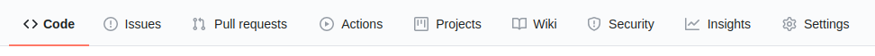

[**Back to Home**](./../README.md)

# Requirements dan Prosedur Pengumpulan Final Project

## Requirements
- Tema bebas.
- Tidak diperbolehkan menggunakan framework apapun.
- Menggunakan DOM (**bukan JQUERY**, **dsb**).
- Menggunakan HTML, CSS dan JS (file terpisah).
- Halaman pertama adalah `index.html` (default).
- Jumlah halaman minimal 1.
- **Bukan lanjutan/copy dari tugas Membuat Web Sederhana dengan HTML dan CSS**.

## Prosedur Pengumpulan

1. Buat sebuah repository di GitHub dengan nama `<username-github>.github.io`.
1. Clone repository tersebut dengan perintah `git clone <username-github>.github.io`.
1. Buka folder hasil `git clone` di code editor kalian.
1. Buat sebuah file HTML dengan nama `index.html`. File tersebut adalah yang akan terbuka pertama kali saat kalian mengunjungi `<username-github>.github.io` pada browser.
1. Kerjakan tugas kalian. Tambahkan file ___*.css___ dan ___*.js___ sesuai dengan final project requirements. Kalian juga bisa menambahkan file gambar atau file suara seperlunya sesuai dengan kreasi kalian.
1. Apabila pengerjaan sudah selesai, eksekusi perintah-perintah berikut:
   - `git add .`
   - `git commit -m '<pesan-commit>'`
   - `git push -u origin main`
1. Kunjungi repository yang sudah kalian buat sebelumnya, kemudian klik **Settings**.

   

1. Scroll ke bawah hingga terdapat pengaturan seperti gambar di bawah.

   

1. Ubah pengaturan tersebut menjadi seperti di bawah, kemudian klik tombol **Save**. Jika tidak ada `master`, pilihlah `main`.

   
1. Final project yang kalian buat akan live di `<username-github>.github.io`.

> Note: Apabila mengunjungi `<username-github>.github.io` menghasilkan error 404, kemungkinan GitHub masih memproses page kalian. Sebagai alternatifnya, kalian bisa menambahkan `/index.html` di belakang URL tadi.

[**Back to Home**](./../README.md)
