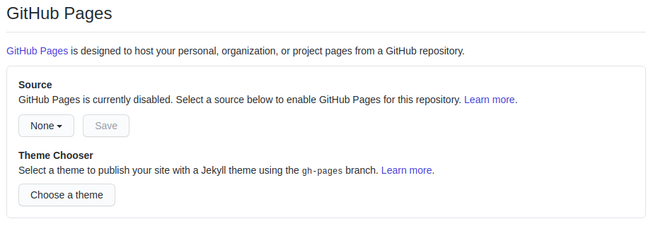
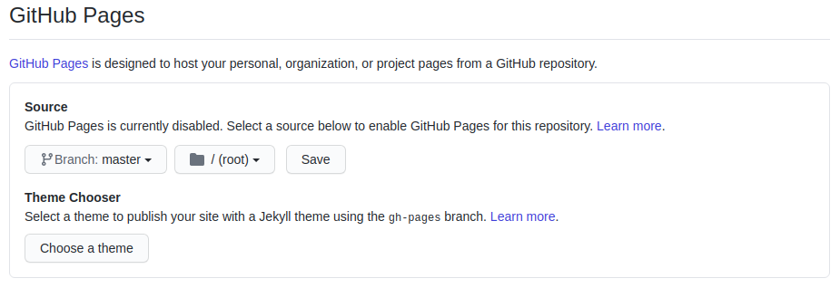

[**Back to Home**](./../README.md)

# Requirements dan Prosedur Pengumpulan Final Project

## Requirements
- Tema bebas.
- Tidak diperbolehkan menggunakan framework apapun.
- Menggunakan DOM (**bukan JQUERY**, **dsb**).
- Menggunakan HTML, CSS dan JS (file terpisah).
- Halaman pertama adalah `index.html` (default).
- Jumlah halaman minimal 1.
- **Bukan lanjutan/copy dari tugas Membuat Web Sederhana dengan HTML dan CSS**.

## Prosedur Pengumpulan

Prosedur ini hanya berlaku apabila kalian sudah memiliki repository `<username-github>.github.io` pada GitHub kalian. Panduan pembuatannya ada di [link ini](prosedur-pengumpulan-tugas-membuat-web-sederhana-dengan-html-dan-css.md)

1. Buat sebuah repository di GitHub kalian. Usahakan nama repository tersebut sesuai dengan tema final project kalian.
2. Clone repository tersebut dengan perintah `git clone <nama-repository>`.
3. Buka folder hasil `git clone` di code editor kalian.
4. Buat sebuah file HTML dengan nama `index.html`. File tersebut adalah yang akan terbuka pertama kali saat kita mengunjungi `<username-github>.github.io/<nama-repository>` pada browser.
5. Kerjakan tugas kalian. Tambahkan file CSS dan JS sesuai dengan final project requirements. Kalian juga bisa menambahkan file gambar atau file suara seperlunya sesuai dengan kreasi kalian.
6. Apabila pengerjaan sudah selesai, eksekusi perintah-perintah berikut:
   - `git add .`
   - `git commit -m '<pesan-commit>'`
   - `git push -u origin master`
7. Kunjungi repository yang sudah kalian buat sebelumnya kemudian kalian di GitHub kemudian klik **Settings**.

   

8. Scroll ke bawah hingga terdapat pengaturan seperti gambar di bawah.

   

9. Ubah pengaturan tersebut menjadi seperti di bawah, kemudian klik tombol **Save**.

   

10. Final project yang kalian buat akan live di `<username-github>.github.io/<nama-repository>/`.

> Note: Apabila mengunjungi `<username-github>.github.io/<nama-repository>` menghasilkan error 404, kemungkinan GitHub masih memproses page kalian. Sebagai alternatifnya, kalian bisa menambahkan `/index.html` di belakang URL tadi.

[Referensi video by Fiqi Fitransyah (github.com/i01107)](https://drive.google.com/file/d/1e5BS8BeEzkdXFpzOfghBQMdHBg3ZRXG4/view?usp=sharing)

[**Back to Home**](./../README.md)
